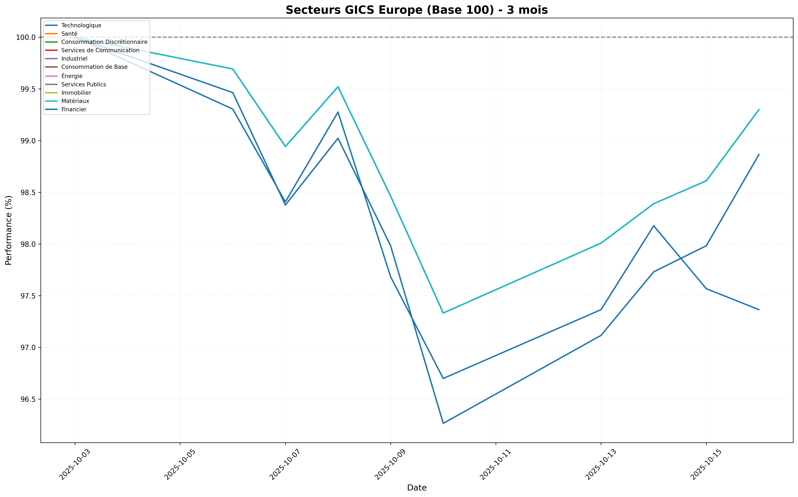
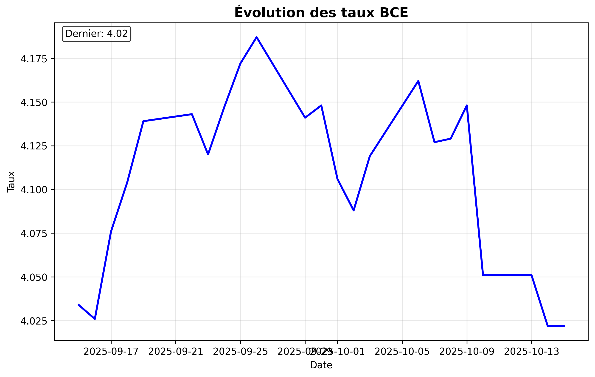
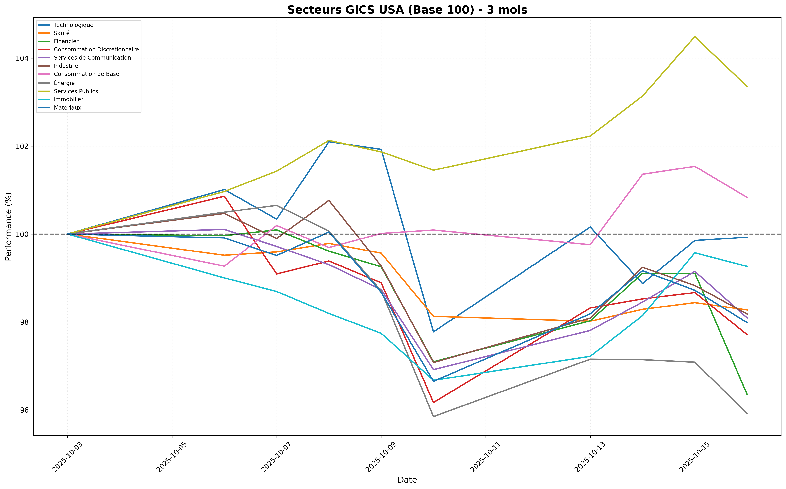
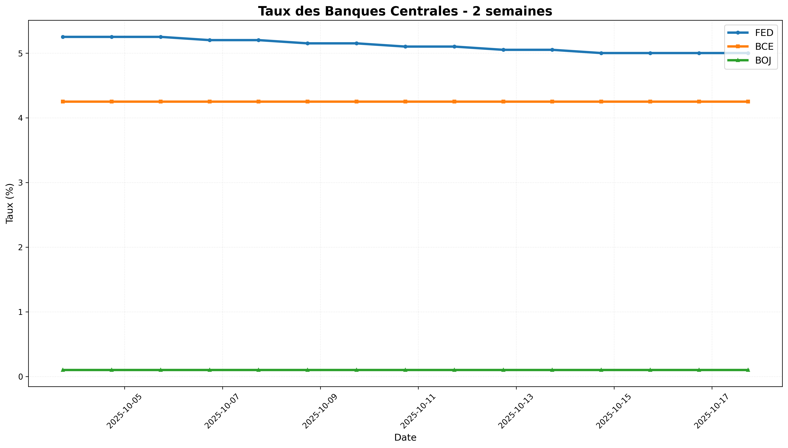
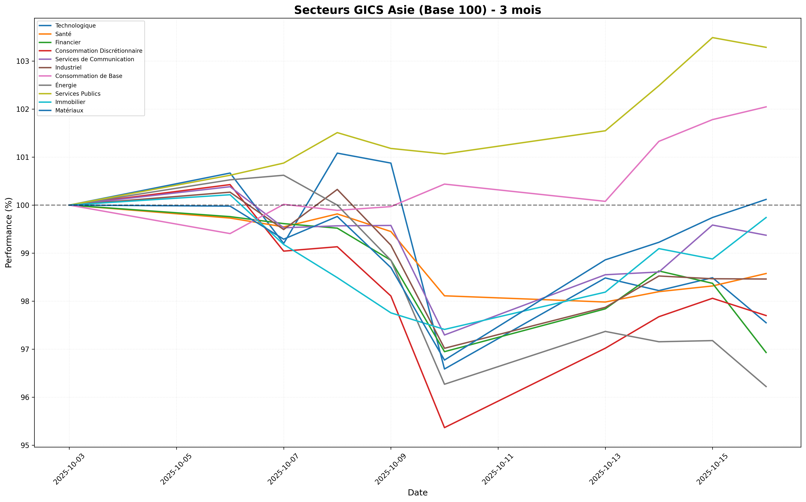
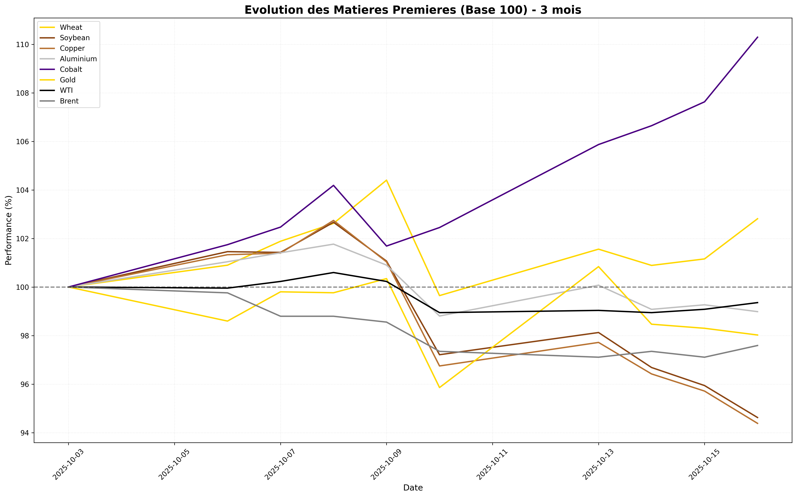
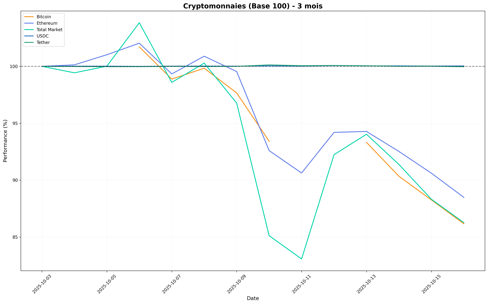

# POINT MARCHÉ HEBDOMADAIRE

## RÉSUMÉ
Cette semaine, les marchés ont été marqués par une dynamique contrastée, entre un shutdown aux États-Unis causé par des désaccords budgétaires et une hausse des indices boursiers. Les investisseurs anticipent également une baisse imminente des taux d'intérêt par la Réserve fédérale (Fed), ce qui pourrait soutenir les marchés à court terme. Dans le même temps, un ralentissement du marché du travail et une volatilité accrue dans le secteur des matières premières, notamment avec la hausse du prix de l'or et la baisse des prix du pétrole brut, soulignent des tensions économiques persistantes. La saison des résultats trimestriels à venir devrait également influencer la direction des marchés, alors que les entreprises se préparent à communiquer leurs performances.

## EUROPE
Les marchés européens ont connu une semaine mitigée, avec des indices boursiers affichant des performances globalement stables malgré le contexte économique incertain. Selon Zonebourse, les principaux indices européens ont montré une résilience surprenante, même si des tensions géopolitiques et économiques demeurent. Les fluctuations des marchés sont en partie attribuées à l'augmentation des droits de douane sur l'acier par la Commission européenne, qui pourrait avoir des répercussions négatives sur le secteur industriel. En effet, cette décision pourrait accroître les coûts pour les entreprises dépendantes de l'acier, potentiellement freinant leur rentabilité à court terme.

- **GICS (11 secteurs)** : Dans le cadre des performances sectorielles, le secteur de l'énergie a été particulièrement touché, avec une baisse de 0.7%, tandis que le secteur des services publics a réussi à se démarquer avec une légère hausse de 0.3%. Ce contraste peut être attribué à la volatilité des marchés de l'énergie et à une demande soutenue pour les services publics, considérés comme des valeurs refuges en période d'incertitude.
  
- **Top Winners / Top Losers** : Les actions du secteur technologique ont enregistré une légère baisse, avec une performance de -1.1%, tandis que certains grands noms, comme TotalEnergies, ont brillé avec une hausse de 2.5% après avoir annoncé des résultats solides dans un contexte de prix du pétrole en baisse.

- **BCE** : La Banque Centrale Européenne (BCE) continue de surveiller de près l'évolution des marchés et l'inflation, qui reste sous pression. Les prévisions économiques indiquent que la BCE pourrait adopter une approche prudente dans ses décisions futures concernant les taux d'intérêt, surtout dans un environnement de hausse des coûts d'importation.

- **Indicateur SMA** : L'indicateur de surchauffe montre que certains secteurs, comme les services publics, affichent une certaine solidité, tandis que d'autres, comme le secteur financier, sont sous pression, ce qui pourrait indiquer des opportunités d'achat dans des secteurs moins cycliques.

## ÉTATS-UNIS
Aux États-Unis, les marchés ont résisté malgré l'annonce d'un shutdown gouvernemental, qui a généré des inquiétudes quant aux impacts économiques à court terme. Selon Les Echos, Wall Street a ouvert en hausse, les investisseurs restant optimistes quant à une éventuelle baisse des taux d'intérêt par la Fed, prévue pour les prochaines réunions. Ce climat d'incertitude n'a cependant pas freiné l'optimisme des marchés, bien que la baisse imminente des taux d'intérêt pourrait être un facteur clé pour soutenir la croissance des actions.

- **GICS (11 secteurs)** : Dans le cadre des performances sectorielles, le secteur technologique a affiché une légère baisse de 0.1%, tandis que le secteur de la santé a chuté de 1.7%, reflétant des préoccupations sur la réglementation croissante et la pression sur les marges bénéficiaires. En revanche, le secteur des matériaux a connu une baisse de 2.0%, ce qui pourrait être lié à la volatilité des prix des matières premières.

- **Top Winners / Top Losers** : Parmi les gagnants, on retrouve des entreprises comme Amazon, qui a vu ses actions grimper de 3.2% cette semaine, soutenue par des prévisions optimistes pour les ventes en ligne. À l'inverse, des entreprises du secteur énergétique, comme ExxonMobil, ont chuté de 4.1% en raison de la baisse des prix du pétrole brut.

- **FED** : La Réserve fédérale semble se diriger vers une politique plus accommodante, avec une baisse potentielle des taux d'intérêt. Cela pourrait renforcer la dynamique des marchés boursiers, surtout si les résultats des entreprises lors de la prochaine saison sont positifs. Les prévisions économiques indiquent que la Fed doit agir prudemment face à un ralentissement du marché du travail, avec des chiffres montrant une diminution des nouvelles embauches.

- **Indicateur SMA** : Les indicateurs de surchauffe montrent que le secteur technologique pourrait être vulnérable à des corrections, tandis que des secteurs comme la consommation de base affichent une solidité relative, attirant ainsi l'attention des investisseurs.

## ASIE
Les marchés asiatiques ont également traversé une période de volatilité, avec des fluctuations significatives dans les valeurs des actions. Selon BlackRock, l'afflux d'investissements dans les cryptomonnaies, en particulier le Bitcoin, a influencé les marchés, même si les actions traditionnelles ont montré des signes de faiblesse. Les investisseurs restent préoccupés par les tensions géopolitiques en cours et les incertitudes économiques.

- **GICS (11 secteurs)** : Le secteur technologique a enregistré une baisse de 2.5%, reflétant des préoccupations concernant la croissance dans un contexte de ralentissement économique. En revanche, le secteur de la consommation de base a augmenté de 2.0%, indiquant une résilience face à l'incertitude.

- **Top Winners / Top Losers** : Des entreprises comme Alibaba ont vu leurs actions chuter de 3.5%, tandis que des sociétés de consommation de base comme Unilever ont connu une hausse de 1.8%, soutenues par une demande constante pour leurs produits essentiels.

- **Banque centrale locale (BoJ/PBoC/RBA)** : La Banque du Japon (BoJ) continue de maintenir une politique monétaire accommodante, mais les marchés anticipent des changements futurs en réponse à l'inflation croissante. La People's Bank of China (PBoC) surveille également de près les conditions économiques, cherchant à stabiliser le yuan et à soutenir la croissance.

- **Indicateur SMA** : Les indicateurs de surchauffe montrent que le secteur technologique est particulièrement fragile, tandis que le secteur de la consommation de base semble bien positionné pour résister à des chocs économiques.

## MATIÈRES PREMIÈRES
Le marché des matières premières a été particulièrement dynamique cette semaine, avec une hausse notable du prix de l'or en raison de l'incertitude économique persistante. Selon Bourse Technique, l'or a atteint de nouveaux sommets, attirant les investisseurs en quête de valeurs refuges. En revanche, les prix du pétrole brut ont connu une baisse significative, ce qui pourrait signaler un affaiblissement de la demande mondiale.

- **Indice CRB** : L'indice des matières premières a montré des signes de volatilité, avec des fluctuations marquées dans les prix du cuivre et de l'aluminium, qui ont tous deux enregistré des baisses respectives de 5.6% et 1.0%.

- **Or (Gold)** : Le prix de l'or a augmenté de 2.0% cette semaine, atteignant un niveau de 98.0, soutenu par des craintes d'un ralentissement économique et une demande accrue de la part des investisseurs cherchant à sécuriser leurs actifs face aux incertitudes.

- **Pétrole (WTI & Brent)** : Les prix du WTI ont baissé de 0.6% et ceux du Brent de 2.4%, reflétant des préoccupations concernant un excès d'offre sur le marché et une demande mondiale en baisse. Les données gouvernementales montrent que les réserves de pétrole continuent d'augmenter, ce qui pourrait peser sur les prix à court terme.

- **Cuivre** : Les prix du cuivre ont baissé de 5.6%, ce qui pourrait indiquer un ralentissement des activités industrielles, surtout en Chine, qui est le plus grand consommateur mondial de cuivre.

- **Wheat, Soybean, Aluminium, Cobalt** : Le blé a enregistré une hausse de 2.8% tandis que le soja a chuté de 5.4%. Le cobalt, en revanche, a vu une augmentation significative de 10.3%, ce qui pourrait refléter une demande croissante pour les technologies de batterie dans un contexte de transition énergétique.

## CRYPTOMONNAIES
Le marché des cryptomonnaies a connu une volatilité extrême cette semaine, avec une forte baisse du Bitcoin et des altcoins. Selon BlackRock, le Bitcoin a chuté de 13.8%, entraînant une baisse générale dans le secteur crypto. Cependant, les investisseurs demeurent optimistes quant à une reprise potentielle.

- **Bitcoin (BTC)** : L'analyse technique montre que le Bitcoin est en train de se stabiliser après sa chute, mais les volumes de trading restent faibles, indiquant une incertitude persistante parmi les investisseurs.

- **Ethereum (ETH)** : L'Ethereum a également subi une baisse de 11.5%, ce qui pourrait être attribué à la volatilité générale du marché et aux préoccupations concernant les régulations futures.

- **Indice Total Market / TOTAL3** : L'indice total du marché des cryptomonnaies a baissé de 13.7%, reflétant un sentiment négatif sur l'ensemble du marché des cryptos.

- **USDC et Tether** : Les stablecoins comme USDC et Tether sont restés stables, maintenant leur ancrage face aux fluctuations du marché, ce qui souligne leur rôle crucial en tant que refuge en période de forte volatilité.

En conclusion, les marchés continuent de naviguer à travers des eaux tumultueuses, avec des tensions politiques, des mouvements de taux d'intérêt, et des incertitudes économiques qui façonnent les perspectives à court terme. Les investisseurs doivent rester vigilants, surveillant de près les développements politiques et économiques qui pourraient avoir des répercussions significatives sur les marchés.